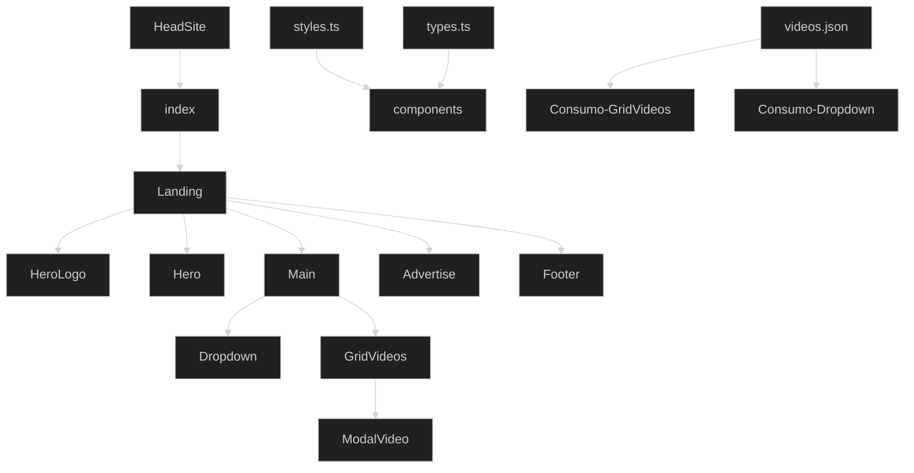
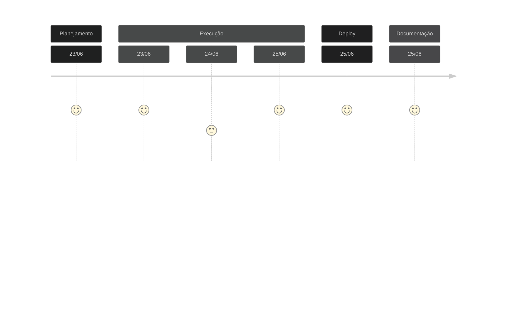

# Teste Leadster FrontEnd - Junho 2023

Bem vindo!
Esta é a solução encontrada para o desafio de Frontend da empresa [Leadster](https://leadster.com.br/) 

## 💾  Acesso ao deploy no Vercel
[Deploy Leadster](https://leadster-alpha.vercel.app/) 

## 📋 Demanda
- [x] Desenvolver um landing page com o framework NextJS;
- [x] Utilizar um arquivo {JSON} para a listagem de vídeos (e seus detalhes) pasra abrir em um modal;
- [x] Utilização de padrões de sintaxe e semântica de código (HTML, Javascript e CSS);
- [x] Atenção à usabilidade da página;
- [x] Utilizar Styled Components;
- [x] Prever Layout responsivo

## ✍️ Desenvolvimento do Projeto

### Decisões de projeto
A proposta de desenvolvimento focou em 3 fatores principais, com foco no princípio DRY `Don't Repeat Yourself`
- Consistência: buscou-se manter uma estrutura consistente em todo o código para facilitar a leitura e compreensão, com o uso de estilo de codificação consistente, incluindo a nomenclatura de variáveis, formatação, indentação e comentários.
- Clareza: a escrita do código foi realizada buscando-se a clareza e a legibilidade, evitando abreviações excessivas e utilizando nomes descritivos para funções, variáveis e classes. 
- Modularidade: o projeto se pautou pela divisão do mesmo em componente e funções menores e bem definidas, cada uma com uma responsabilidade específica, visando a manutenção, teste e reutilização do código.

### Organização do código
Na organização do código buscou-se seguer os seguintes princípios:
- Estrutura de diretórios: organização do código em uma estrutura de diretórios lógica e coerente, separando componentes distintos, como módulos, modelos, arquivos de configuração.
- Modularidade: divisão do código em arquivos e módulos separados, com base em sua funcionalidade ou propósito.
- Documentação: descritivo com uma documentação adequada para o projeto, descreve a finalidade do projeto, instruções para instalação, dependências, configuração e execução.

### Linha de Raciocínio
Para a realização do desafio estabeleci alguns parâmetros a seguir no desenvolvimento
- Inicialmente o projeto foi dividido em 5 partes principais `/HeroLogo.tsx`, `/Hero.tsx`, `/Main.tsx`, `/Advertise.tsx`, `/Footer.tsx`, seguindo a lógica de que cada um componente ser reutilizado em outros projetos. 
- A seção `/Main.tsx`, que renderiza o principal contexto do projeto, foi subdividida em `/Dropdown.tsx` para fazer a filtragem dos vídeos e `/GridVideos.tsx` que efetivamente renderiza a sequência de vídeos na página.
- Do componente `/GridVideos.tsx` deriva `/ModalVideo.tsx` que é responsável pela renderização do modal quando um dos vídeos é selecionado.
- Foi gerado um arquivo `/videos.json` para consumo de informações pelo `/GridVideos.tsx`. Este é o arquivo de entrada de todas as informações relativas aos vídeos.

### Expansibilidade
Prevendo a possibilidade de extensão futura do site para novas linguagens (atingir novos mercados) já foi incluído um sistema de consumo de texto via `/texts.json` com a utilização de uma util `/textUtils.ts` com similaridade ao sistema `/i18n`. Desta forma, futuramente, ao se optar por um sistema de tradução do site para outras línguas, já teremos um consumível em JSON funcional, bastando adicionar as traduções desejadas.

### Organograma Estrutural


### Linha do Tempo


## ⚙️ Linguagens de programação
[](https://www.linkedin.com/in/targanski/)

## 🖥️ Documentação de Implantação

### Pré-requisitos
Antes de prosseguir com a implantação, é necessário garantir que o ambiente de desenvolvimento atenda aos seguintes pré-requisitos:
Node.js (versão 12 ou superior) instalado no servidor de hospedagem
Gerenciador de pacotes npm (ou yarn) instalado

### Etapas de Implantação
Siga as etapas abaixo para implantar o código web:

1. Clone o repositório do código web para o servidor de hospedagem.
```bash
git clone https://github.com/Ftarganski/leadster.git
```

2. Navegue até o diretório raiz do projeto clonado.

3. Execute o seguinte comando para instalar as dependências do projeto:
```bash
yarn install
```

4. Após a conclusão da instalação das dependências, execute o seguinte comando para iniciar a aplicação:
```bash
yarn dev
```
Este comando irá iniciar a aplicação no modo de desenvolvimento.

5. Acesse a aplicação web no navegador utilizando o endereço local: 
[http://localhost:3000](http://localhost:3000)

## 📄 Configurações Adicionais

### Metadados
A página inicial `/index.tsx` e o componente `/HeadSite.tsx` contêm metadados importantes para SEO e exibição nos motores de busca. Certifique-se de atualizar as informações conforme necessário, incluindo o título, descrição, palavras-chave e favicon.

### Imagens e Logos
Certifique-se de substituir as imagens de exemplo pelos arquivos corretos da sua aplicação. As imagens estão localizadas na pasta `/public/images`. Certifique-se de manter a estrutura correta de pastas e atualize as referências de imagem nos componentes apropriados.

### Dados dos Vídeos
O componente `/GridVideos.tsx` utiliza dados estáticos de vídeos a partir de um arquivo JSON `/Main/videos.json`. Certifique-se de atualizar os dados do arquivo JSON com os vídeos corretos da sua aplicação.

### Considerações Finais
Após a conclusão dessas etapas, o código web estará implantado e acessível por meio do servidor de hospedagem. Certifique-se de realizar os testes necessários para garantir que a aplicação esteja funcionando conforme o esperado.

Lembre-se de que esta documentação cobre apenas a implantação do código web. Outros aspectos, como implantação de banco de dados, configurações de servidor e escalabilidade, podem exigir etapas adicionais que não são abordadas aqui.

### Deploy de Desenvolvimento
O deploy de desenvolvimento foi realizado na plataforma Vercel e pode ser acessado em [Deploy Leadster](https://leadster-alpha.vercel.app/) 
